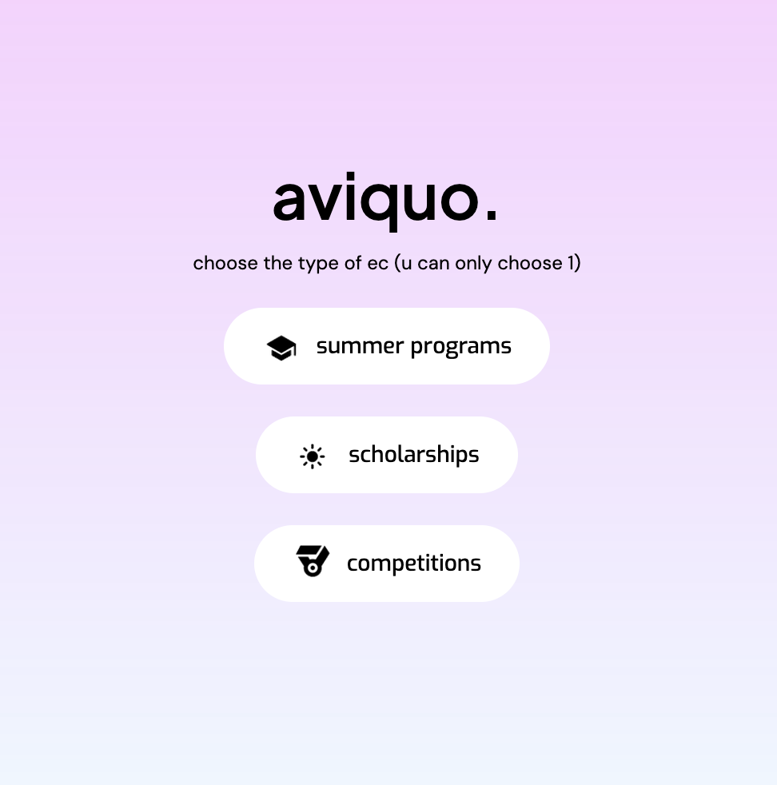

# aviquo 
  
Here is the source code of our extracurricular finder. It currently uses no more advanced features than a database lookup, but we will definitely be incorporating some type of neural network in the near future. 

The source is open, but the database is not, for legal reasons. You can add your own scholarship data by running the code.

## Usage

Below is the shell input for building and running the Aviquo EC finder.

```bash
# clone
git clone https://github.com/om-raheja/aviquo-ec-frontend
cd aviquo-ec-frontend

# build
go build

# run
./main
```

It runs on port 8888 by default and can be viewed on a web browser using the URL `http://localhost:8888`.


## Demo

[](https://aviquo.com)
